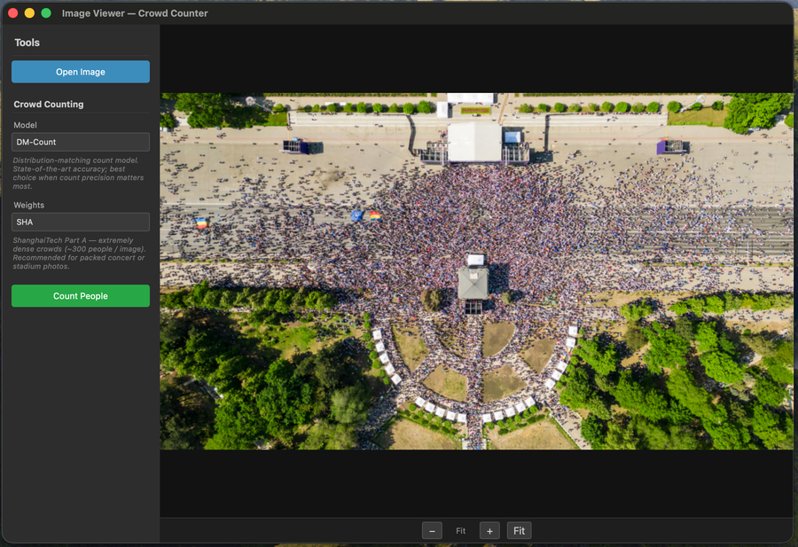
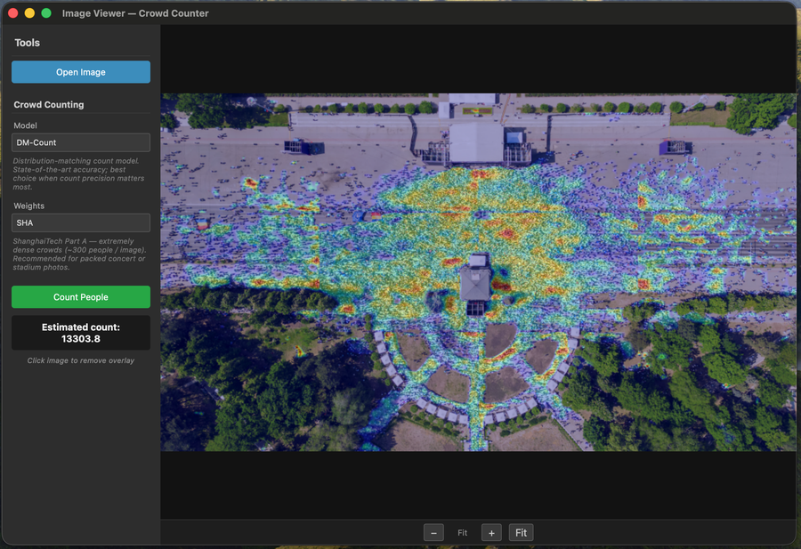

# Crowd Counter — Image Viewer

A desktop application for viewing images and estimating crowd sizes in overhead photos using deep learning density-map models.


*Image loaded and ready for counting*


*Density heatmap overlaid after counting — estimated 13,303 people*

## Features

- **Image viewer** with zoom (mouse wheel, +/- buttons, fit-to-window), drag-to-pan, and arrow key navigation
- **Crowd counting** using the [lwcc](https://github.com/tersekmatija/lwcc) library with four available models:
  - **CSRNet** — fast, reliable baseline
  - **SFANet** — handles varied crowd scales
  - **Bay** — Bayesian loss, high accuracy
  - **DM-Count** — state-of-the-art distribution matching
- **Density map overlay** blended on top of the original image to visualise where the model detects people
- Automatic **tile-based processing** for large images to keep memory usage manageable
- Remembers the last opened directory between sessions

## Requirements

- Python 3.10+
- macOS, Linux, or Windows

## Setup

```bash
# Create and activate a virtual environment
python -m venv .venv
source .venv/bin/activate        # macOS / Linux
# .venv\Scripts\activate         # Windows

# Install dependencies
pip install -r requirements.txt
```

## Usage

```bash
source .venv/bin/activate
python main.py
```

1. Click **Open Image** to load a photo
2. Select a **Model** and **Weights** from the sidebar (descriptions are shown for each)
3. Click **Count People** — a progress bar appears while the model runs
5. The estimated count is displayed and a density heatmap is overlaid on the image
6. **Click the image** to remove the overlay and return to the original
7. Opening a new image resets everything

### Navigation

- **Mouse wheel** — zoom in/out
- **Click and drag** — pan the image
- **Arrow keys** — pan the image
- **Fit button** (bottom toolbar) — reset zoom to fit the window
- **+/−** buttons — zoom in/out

## Notes

- The first count with a given model/weights combination will download the model weights (~100 MB) to `~/.lwcc/weights/`. Subsequent runs use the cached files.
- Large images are automatically split into tiles (max 1000 px per dimension) to keep memory usage reasonable.
- Counting runs in a background thread — the UI stays responsive and you can press **Stop** to cancel.
